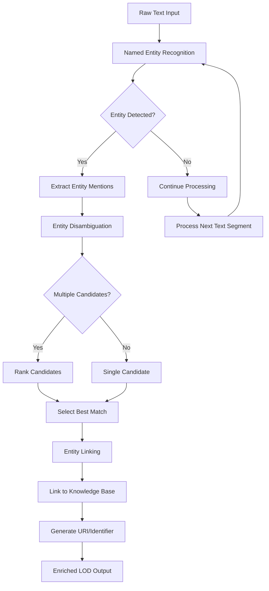

# Tasks

Here you can find the Jupyter notebooks which serve as examples of an automatic entity analysis of museum metadata texts, while using large language models. We use four notebooks for this:

* data\_preparation.ipynb: read the texts (descriptions of artefacts) and make them available to the next notebook
* ner.ipynb: find the named entities in the texts
* disambiguation\_candidates.ipynb: find the appropriate WikiData identifiers for the entities
* entity\_linking.ipynb: detemine the relations between the entities and artefacts covered by the original texts

The notebooks communicate by files named `output\_task\_hash.json` (hash is a random string), where the output file of one notebook is the input file of the next notebook. The final notebook generates output files in two data formats: `output\_linking\_hash.json` (JSON) and `entities\_tables.csv` (csv). They can be run on your own system or on [Google Colab](https://colab.research.google.com/).

The notebooks are supposed to be run without requiring additional resources. However, if you want to apply the notebooks to your own data, you will need to change the first one (change the name of the input data file). In that case you will also need an OpenAI API access key ([Create a key](https://platform.openai.com/docs/quickstart/authentication)). This requires registering with the company OpenAI and paying them a small amount to get credits for running their software. The key is a string which needs to be stored in a file named `OPENAI_API_KEY` in the directory with the notebooks.

## NER to Linking Flow

Old flowchart created while designing the notebooks:

