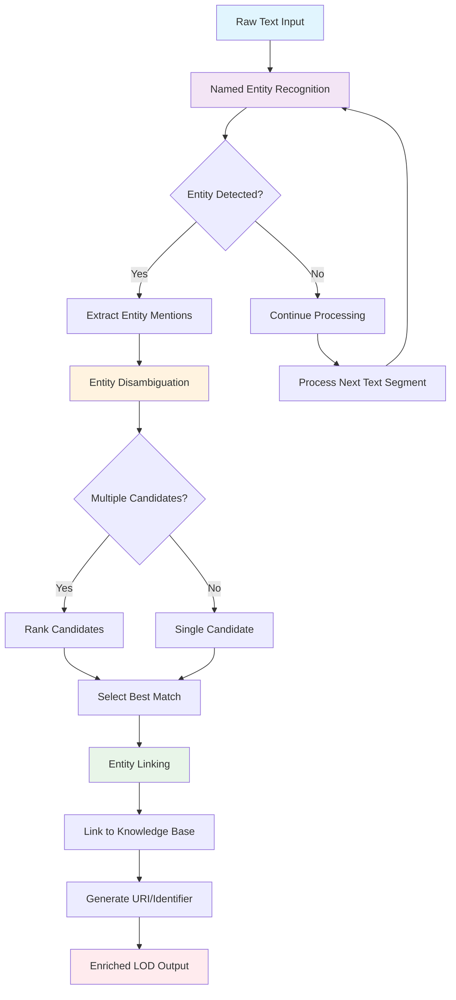

# Tasks

## NER to Linking Flow

```mermaid
flowchart TD
    A[Raw Text Input] --> B[Named Entity Recognition]
    B --> C{Entity Detected?}
    C -->|Yes| D[Extract Entity Mentions]
    C -->|No| E[Continue Processing]
    
    D --> F[Entity Disambiguation]
    F --> G{Multiple Candidates?}
    G -->|Yes| H[Rank Candidates]
    G -->|No| I[Single Candidate]
    
    H --> J[Select Best Match]
    I --> J
    J --> K[Entity Linking]
    
    K --> L[Link to Knowledge Base]
    L --> M[Generate URI/Identifier]
    M --> N[Enriched LOD Output]
    
    E --> O[Process Next Text Segment]
    O --> B
    
    style A fill:#e1f5fe
    style B fill:#f3e5f5
    style F fill:#fff3e0
    style K fill:#e8f5e8
    style N fill:#ffebee
```

